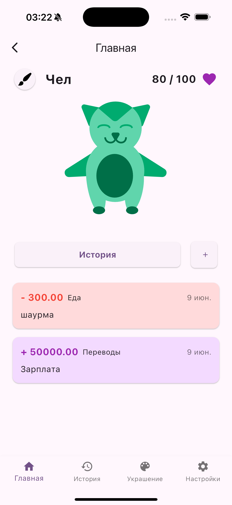
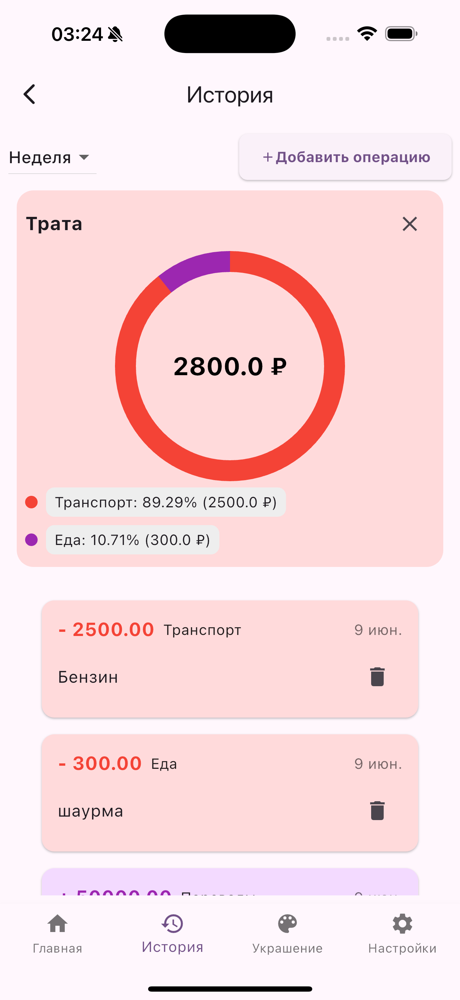
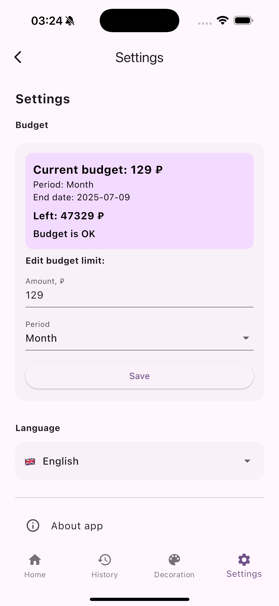

# MoneyTama

MoneyTama — это мобильное приложение на Flutter, сочетающее финансовый трекер и виртуального питомца тамагочи. Ваша финансовая дисциплина напрямую влияет на здоровье и настроение питомца. Приложение мотивирует вести учёт расходов и доходов, ставить бюджет и развивать полезные финансовые привычки.

---

## 📱 Скриншоты

  
  
  
  

---

## 🚀 Возможности

- **Виртуальный питомец**: здоровье зависит от ваших финансовых действий  
- **Учёт доходов и расходов** с возможностью фильтрации  
- **Гибкое управление бюджетом** (день/неделя/месяц)  
- **История операций** с категоризацией  
- **Аналитика по категориям**    
- **Интерфейс на русском и английском** (поддержка локализации)  
- **Кастомизация питомца** (цвет, украшения)  
- **Сохранение данных на устройстве (SharedPreferences)**  
- **Удобный современный UI с поддержкой тёмной темы**  
- **Поддержка iOS и Android**

---

## 🏗️ Архитектура проекта

- **Flutter + Dart**  
- **State management:** Provider + Bloc (для отдельных экранов)  
- **SharedPreferences** — хранение бюджета и данных пользователя  
- **Локализация:** [Flutter Intl](https://docs.flutter.dev/accessibility-and-localization/internationalization)  
- **Роутинг:** через `NavigationService` и именованные маршруты  
- **DI:** через get_it
